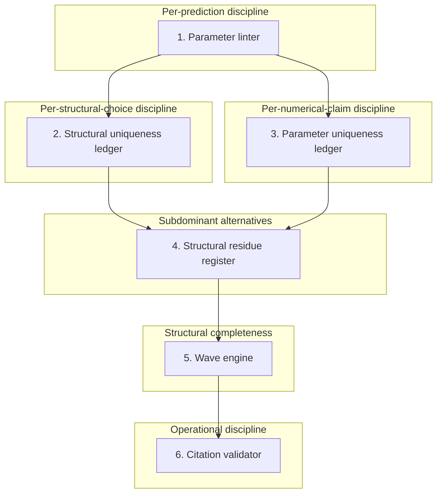

# Audit infrastructure

The framework's claim that no step curve-fits is held by **six audit instruments**, each watching a distinct way derivations can cheat.

## 1. Parameter linter

Hard quality gate on new parameter predictions. Every load-bearing step in a derivation must be one of:

- **A foundational invocation** — direct use of one of the three irreducible commitments, the empirical labeling rule, or a derived foundational theorem (the toggle algebra, the description-length retention threshold, the complex-Hilbert-space derivation, local fermionic statistics, or the observer-persistence theorem).
- **Explicit algebra**, symbolically verified by a computer algebra system with the verification reference inline.
- **A cited theorem** — published mathematical result with author, year, and page.
- **An upstream closed file** — reduces to another already-passing prediction file or a closed theorem document.
- **A master-theorem chain** — a direct member or downstream chain of one of the framework's class master theorems.
- **A meta-theorem closure** — algebraic closure via the framework's rationality meta-theorem (predictions must lie in $\mathbb{Q}(\sqrt{2}, \sqrt{3}, \sqrt{5})$ unless explicitly flagged).

Three additional **blocking clauses** added during 2026's strict-rigor pass:

- A **uniqueness-defense clause** — every prediction must defend why the framework's choice (out of all operator-permitted alternatives at each layer) is forced.
- A **numerical-match clause** — predictions are compared to measurement strictly against the published experimental uncertainty.
- A **rationality bright-line clause** — Standard-Model imports must lie in the framework's allowed rational/irrational field, ruling out smuggling in pure-number constants from outside.

## 2. Structural uniqueness ledger

About two dozen rows. For every structural choice the framework makes (coordination number, lattice, Clifford algebra, walk survival rate, sector decomposition, substrate-to-Planck identification, etc.), the ledger names the operator-permitted alternative set, the selection criterion, and the resulting status:

- **UNIQUE** — every alternative strictly eliminated.
- **DOMINANT** — alternative set non-empty, but the framework's choice has a strictly positive margin under description-length comparison.
- **ONE-AMONG-MANY** — multiple alternatives clear simultaneously; the framework retains the multiplicity or arbitrarily picks one (a flagged gap).

Each row can be flagged as **CONDITIONAL** on an upstream row or as having a **GAP** at its own layer.

## 3. Parameter uniqueness ledger

About seventy rows. Same audit applied to numerical claims ($V_{us} = 9/40$, the $(2/3)^8$ coupling, $V_{cb} = 256/6305$, the baryon-to-photon ratio formula, etc.) — but at the formula layer rather than the structural layer. For each numerical claim, the ledger names which alternative formulas could have produced the observed value, and why each is excluded.

## 4. Structural residue register

The framework's retention threshold (see [Chapter 4](story/04-recurrence-and-the-mdl-waterline.md)) keeps *every* above-threshold alternative simultaneously, not just the dominant one. Subdominant alternatives carry non-zero weight and may produce downstream artifacts. Each such residue is tracked with status:

- **OPEN** — suspicion only.
- **TRACED** — downstream signature estimated; consistent with current data.
- **ACCOUNTED-FOR** — the residue *is* an existing framework derivation (catalogued as a worked example).
- **REFUTED** — downstream check ruled out the alternative.

**Discipline rule:** every new prediction must consult this register and either include the residue's contribution or argue why it is hard-gated.

## 5. Wave engine

A catalog of about 220 derivation operations the framework permits, organized layer by layer. Every operation must fire from upstream content; if any can't, there's a structural gap. Currently every operation fires.

## 6. Citation validator

A discipline tool that scans prediction files and theorem documents for upstream citations. Used as a pre-commit-hook candidate; fails the commit if a file makes a claim without linking it to the audit framework.

## How these compose

A new prediction must pass each instrument; a re-audit of an existing prediction can fire any one of them.

## The rigorous version

For full descriptions and the live ledgers, see the framework's research tree linked from the [reference page](reference.md).
