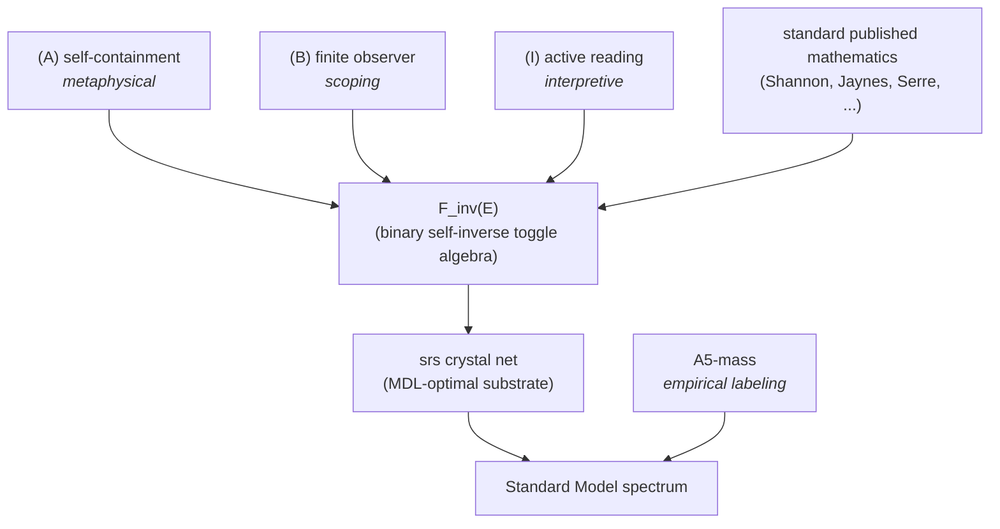

# Chapter 2 — Three irreducible commitments

The framework rests on three irreducible commitments plus one empirical labeling rule plus standard published mathematics — nothing else. Each commitment is **named explicitly** rather than absorbed silently into a single "axiom".

## (A) Self-containment

**Metaphysical.** The universe is closed to itself; nothing comes from outside, because nothing is outside. This is the framework's refusal to import external structure — no boundary conditions, no anthropic priors, no multiverse selection. It is metaphysical: it cannot be proved from anything more fundamental because it stipulates that nothing more fundamental is supplied.

Operationally, (A) is the **no-privilege principle** that recurs at every later step: nothing supplied → no preferred configuration (uniform measure), no preferred direction (no commutation relations imposed), no preferred spatial orientation (substrate model is strongly isotropic).

## (B) Finite observer

**Scoping.** The framework describes observers with finite memory. This is a scoping definition — a statement about the *subject* of the framework's predictions — not a physical postulate. It scopes the framework to the actual case (any real observer is finite; no science is conducted by an observer with unbounded memory).

Under (B), the observer's perceived substrate is discrete (Cover-Thomas source coding 2006 §1.6, §5.4): finite memory means finitely many distinguishable internal states, and the substrate is at most as fine as those.

## (I) Active reading

**Interpretive.** A binary distinction labeled $e$ is read as an *operator* $T_e$ on configurations — mapping each configuration to the one differing in slot $e$ — rather than passively as a static label attached to configurations. Under the active reading, $T_e \circ T_e = \mathrm{id}$ (binary symmetry has no preferred direction), so $T_e = T_e^{-1}$: the operator is its own inverse.

This is *adopted*, not derived. Alternative readings (passive, asymmetric) yield strictly weaker frameworks; under (A)'s no-exterior principle, the active reading is the natural and minimal choice.

## The three commitments + standard math force the rest

Under (A) + (B) + (I) — with Shannon's 1-bit minimum giving the binary primitive (Shannon 1948 §I), Jaynes' max-entropy giving the uniform measure (Jaynes 1957), Cover-Thomas giving discreteness of the observer's perceived substrate, and Serre's reduced-word uniqueness closing the algebra (Serre 1980 §I.1 Prop 4) — **the binary self-inverse toggle and the free involutive monoid $F_{\mathrm{inv}}(E)$ on a finite alphabet $E$ are uniquely forced** as the observer's primitive update and its algebra.

The full 8-step derivation is in [`theorem_toggle_from_self_containment.md`](https://github.com/tekcorman/standard-model-derivation/blob/main/docs/theorems/theorem_toggle_from_self_containment.md). The content previously postulated as A1 (binary self-inverse toggle) and P1' (observer-as-finite-register) is preserved; their status as standalone axioms is not.

## One downstream commitment: A5-mass

A5-mass is the empirical labeling that identifies which Ramanujan eigenvalues of the substrate's Bloch-Hashimoto operator correspond to which Standard Model masses. **It is not structural** — it is the framework's analog of "the Lagrangian of the Standard Model is the Lagrangian of nature." It is validated by per-prediction accuracy against measurement, not derived from (A)+(B)+(I).

## Summary

The framework's irreducible commitments are therefore **(A) + (B) + (I) + A5-mass**. Everything else is theorem.

## Next

[Chapter 3 — The cover that holds chirality](03-the-cover-that-holds-chirality.md): the substrate srs is chiral (one-handed). srs-z is its bipartite double cover. The cover supplies the chirality grading without which a mass operator cannot exist.
