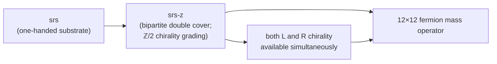

# Chapter 3 — The cover that holds chirality

This is the chapter the framework's pitch is built around. Two graphs; one is a double cover of the other; the cover is what makes the mass spectrum possible.

## srs — the substrate

Under self-containment + finite observer + active reading — applied to *spatial* labels via the no-privilege principle — the framework's substrate is singled out as the crystal net known in crystallography as **srs** (the Laves / (10,3)-a net). The honest chain (updated 2026-07-01, per the R-9 supersession in the structural-residue register):

1. Self-containment forbids privileging any spatial direction or edge orientation — that would be "which-way" information the framework refuses to supply.
2. Combined with three spatial dimensions and coordination number three (both derived upstream), this forces an **arc-transitive** substrate — the admissible-set definition, with Sunada 2012 supplying the classification landscape.
3. Fingerprinting all nine vertex-and-edge-transitive chiral 3D candidate nets leaves a small MDL-waterline **survivor set** {srs, srs-c8, lou, lov}; **srs is its dominant member**, discriminated by the structural fingerprint against observation.

srs is therefore the *dominant waterline survivor*, not a uniquely-forced choice. A data-free discriminator separating srs from the other three survivors is a logged open equation (the incomplete-equations ledger §6). Strong isotropy — a true, Sunada-certified property of srs — was found not to carry the selection load (the mirror cover srs-z is itself arc-transitive). Under the framework's own waterline reading, a survivor superposition is native: everything above the line coexists, and observation discriminates.

<figure markdown>
  <iframe src="../../assets/3d/srs_viewer.html" width="100%" height="520" style="border: 1px solid #2d2d40; border-radius: 6px; background: #0a0a14;" loading="lazy"></iframe>
  <figcaption>Interactive 3D viewer — drag to rotate, scroll to zoom. The default mode shows the srs lattice (one chirality, single color). Click <strong>srs-z (bipartite cover)</strong> to switch to the double-cover view: the two color classes (warm = L-chirality sublattice, cool = R-chirality sublattice) make the ℤ/2 chirality grading literally visible. Every bond in the cover crosses between the two color classes — those crossing bonds are the L↔R coupling sites a mass operator needs.</figcaption>
</figure>

**srs is chiral.** The (10,3)-a Laves net has a mirror partner srs* of opposite handedness. The MDL waterline ([Chapter 4](04-recurrence-and-the-mdl-waterline.md)) retains both — the framework predicts chirality as a structural feature, not as an adoption.

## The problem srs alone cannot solve

A **mass operator** is fundamentally Dirac: it couples left-handed to right-handed chirality. A mass term needs both chirality copies to coexist in one structure with edges between them.

srs alone is *one-handed*. You cannot put a Dirac mass operator on srs — there is nowhere for left and right to coexist and couple.

So either:

- the framework cannot produce a mass spectrum (in which case it fails), or
- there is a richer structure available, derivable from the substrate, that *does* have a chirality grading.

## srs-z — the bipartite double cover

**srs-z is the bipartite double cover of srs.** It carries the same Hashimoto (non-backtracking walk) eigenvalue $h = (\sqrt{3} + i\sqrt{5})/2$ as srs, but with doubled multiplicity at the corresponding high-symmetry point of its Brillouin zone.

"Bipartite" means **two-colorable**: the cover splits naturally into two sublattices, with every edge crossing between them. *That coloring IS the chirality grading.* Each sublattice is one chirality copy; the inter-sublattice edges are the L↔R coupling sites a mass operator needs.

## The structural pitch

> "Why this substrate?" and "why this mass spectrum?" are the same question seen from two sides — **quotient vs cover**. srs is the MDL-optimal substrate; srs-z is the bipartite double cover that supplies the chirality grading without which a mass operator cannot exist. The framework didn't postulate the cover; it followed it.

## What srs-z gets you concretely

A 12×12 fermion mass operator lives at the cover layer. From this single operator the framework reads out:

- All twelve charged-fermion and neutrino mass eigenvalues.
- A massless lightest neutrino: $m_{\nu_1} = 0$ exactly.
- The up-type / down-type split (up-type couples to the conjugate Higgs, which is even-grade and cannot flip handedness, giving zero walker length; down-type Higgs is odd-grade, giving a walker length equal to the substrate's girth).
- The top quark mass at $m_t = 172.41$ GeV (−0.95σ vs PDG: Type-II saturation $y_t = 1$ at unification, times the resolvent's own forced first-girth-return dark correction $(1 - \alpha_1/h_P^2)$, shipped 2026-06-25; the bare pre-dark value 174.10 GeV sat at +4.71σ).

Of the framework's roughly 95 published predictions, exactly 14 take different numerical values on the quotient (srs) versus the cover (srs-z), and all 14 are "doubled primitive cell" quantities: things like the Cabibbo angle ($V_{us}$ moves from 9/40 to 9/80), the dark-correction coefficient (from 5/12 to 3/8), the baryon-asymmetry base factor, the two heavier neutrino masses, and the first two PMNS angles. Everything intensive — pure ratios, dimensionless couplings, mixing angles — is bit-identical between the quotient and the cover.

### The 96 = 2 × 48 count

A striking consequence of the doubling: per srs cell, the substrate carries **96 fermion states** (counted from the Clifford-algebra Fock space at each trivalent node). That is **exactly twice the 48 states** of three Standard Model generations.

Three readings of this fact, in increasing order of speculative commitment:

1. **Counted: 96 = 2 × 48.** This count is verified in the substrate, full stop.
2. **Necessary condition identified.** If the extra 48 states realize the matter content of the Minimal Supersymmetric Standard Model (MSSM), they must be *complex scalars* sitting at the same gauge representations and hypercharges as the SM matter (squarks, sleptons, etc.) — not fermion mirrors. This is forced by checking which matter content reproduces the MSSM gauge-coupling beta-coefficients: a 6-generation fermion mirror matches MSSM on two of the three coefficients but fails on hypercharge, ruling pure-fermion-doubling out. Complex-scalar SUSY partners, with each partner sharing its parent fermion's hypercharge, give the match across all three.
3. **Sufficient condition: open.** Whether the Clifford-algebra Fock structure actually produces the specific boson/fermion split that supersymmetry requires is under active investigation. If it closes, seven of the framework's gauge-sector predictions (the electroweak and strong couplings at the Z-boson scale, the Weinberg angle, and the Z mass itself) become fully unconditional rather than conditional on the supersymmetric matter content.

The narrative-safe statement: **the bipartite double cover holds the chirality grading that makes a mass operator possible, and produces exactly twice the Standard Model fermion state count.** The mass operator follows; the supersymmetric interpretation is one open path forward, not a derived consequence.

## Next

[Chapter 4 — Recurrence and the MDL waterline](04-recurrence-and-the-mdl-waterline.md): how the observer's finite memory turns recurrence into structure, and why MDL is a *waterline* (every above-threshold compression retained) rather than a strict minimum.
