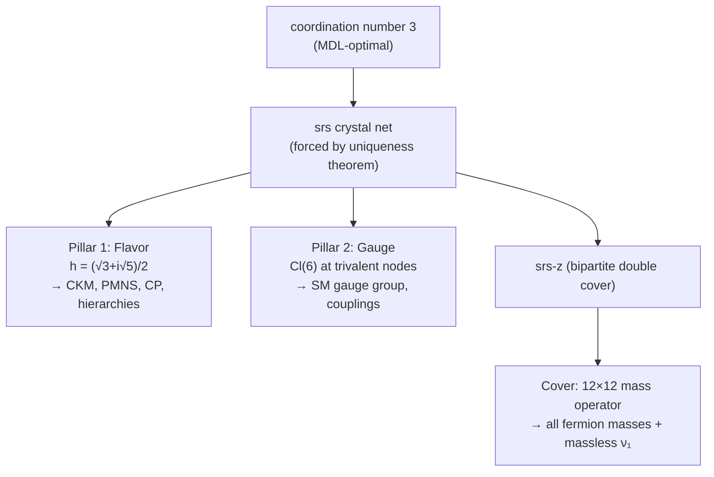

# Chapter 6 — The two pillars

With complex Hilbert space forced ([Chapter 5](05-complex-hilbert-is-forced.md)) and the bipartite cover supplying the chirality grading ([Chapter 3](03-the-cover-that-holds-chirality.md)), the Standard Model content emerges from **two algebraic structures on the srs lattice**:

| Pillar | Object | What it encodes |
|---|---|---|
| **Flavor** | $h = (\sqrt{3} + i\sqrt{5})/2$ | mixing angles, CP phases, mass hierarchies |
| **Gauge** | $\mathrm{Cl}(6) = \mathrm{Cl}(4) \otimes \mathrm{Cl}(2)$ | gauge group, couplings, fermion content |

Both pillars derive from one upstream fact: $k_* = 3$ (the substrate's coordination number, MDL-optimal per `predictions/k_star.py`).

## Pillar 1 — Flavor

### The Hashimoto eigenvalue

The Hashimoto (non-backtracking) operator $B$ acts on directed edges of the substrate. Bloch decomposition over the srs lattice quotient produces a spectral measure on the Brillouin zone. At the high-symmetry **$P$ point** of the BCC Brillouin zone, the eigenvalue with maximum magnitude is

$$h = \frac{\sqrt{3} + i\sqrt{5}}{2}.$$

This is the **Ramanujan eigenvalue** — it saturates the Alon–Boppana bound (Lubotzky 1994 §4) for the substrate's regularity class. $|h|^2 = 2 = k_* - 1$ exactly; the framework is operating at the *theoretical maximum* of spectral expansion for a $k_* = 3$ Cayley graph.

### What $h$ encodes

A single complex number carries the entire flavor sector:

- **CP phases** — $\delta_{CP}^{CKM} = \arccos(1/3) = 70.53°$ via the $V_{-1}$–$T_{B-L}$ identity (matches PDG at $+0.68\sigma$); $\delta_{CP}^{PMNS} = \arccos(-1) = 180°$ from the same identity (matches NuFIT 6.0 at $+0.16\sigma$).
- **Mixing angles** — $\theta_{12}^{PMNS}$, $\theta_{13}^{PMNS}$, $\theta_{23}^{PMNS}$ from Hashimoto spectral readings + edge-local corrections.
- **CKM elements** — $V_{us} = 9/40$, $V_{cb} = 256/6305$, $V_{ub} = \sum_{m \geq 2} (2/3)^{6m+2}/(1-(2/3)^{6m+2})$ as direct geometric series + counting fractions on the substrate. For example, $V_{cb}$ is the sum over girth-cycle windings on the substrate, which the MDL waterline ([Chapter 4](04-recurrence-and-the-mdl-waterline.md)) retains all of simultaneously:

<video controls autoplay muted loop playsinline width="100%" style="max-width: 800px; display: block; margin: 0 auto;">
  <source src="../../assets/animations/vcb_windings.mp4" type="video/mp4">
</video>

*Each winding $n$ contributes $(2/3)^{8n}$ to the $V_{cb}$ amplitude. The waterline retains all windings simultaneously; their sum is $\sum_{n \geq 1} (2/3)^{8n} = (2/3)^8 / (1 - (2/3)^8) = 256/6305 \approx 0.04060$, matching the measured value within experimental uncertainty. This is the geometric-series structure the framework would miss if it took the strict-minimum reading instead of the waterline reading.*
- **Cosmic birefringence** — $\beta = \sin(\arg h) \cdot \alpha_{EM}(M_Z) = 0.354°$ (matches Eskilt 2022 at $+0.13\sigma$).
- **Baryon asymmetry** — $\eta_B = (\sqrt{3}/10) \cdot (2/3)^{48}$ via the Sakharov–Hashimoto chain (matches at $-0.20\sigma$).

The single complex number $h$ — with no fitted parameters — yields ~20 numerical matches across the flavor sector. **This is the framework's first over-determination.**

!!! note "Visualization"
    A static complex-plane diagram of $h = (\sqrt{3} + i\sqrt{5})/2$ sitting on the Ramanujan circle $|z|^2 = k_* - 1 = 2$ — showing $\mathrm{Re}(h) = \sqrt{3}/2 \approx 0.866$, $\mathrm{Im}(h) = \sqrt{5}/2 \approx 1.118$, $|h| = \sqrt{2}$, $\arg h \approx 52.24°$ — will land in a subsequent pass alongside an interactive complex-plane viewer showing how powers $h^n$ trace out the framework's CP phases (every $\arg h^n = n \cdot \arg h \mod 2\pi$).

## Pillar 2 — Gauge

### Cl(6) on the trivalent node

At each $k_*$-valent node of the substrate's lattice quotient ($k_* = 3$), the local edge-mode algebra has two presentations: bosonic (Weyl) and fermionic (Clifford). **Description-length comparison prefers the fermionic presentation** — the Clifford Fock space is finite-dimensional at each grade; the Weyl Fock space is exponentially large; the recurrence content fits in the smaller register.

Jordan–Wigner (Jordan–Wigner 1928) converts the substrate's involutions into anticommutators on a 1D ordering of the substrate. **Local CAR is therefore a theorem of (A)+(B)+(I) + Jordan–Wigner** (`docs/theorems/theorem_car_local_jordan_wigner.md`); global CAR remains open but is not load-bearing for any current prediction.

The local Clifford algebra is $\mathrm{Cl}(2k_*; \mathbb{C}) = \mathrm{Cl}(6; \mathbb{C})$. Its spinor representation is **8-dimensional** (Lawson–Michelsohn 1989 §I.5).

### Pati–Salam decomposition

The Spin(6) acting on the 8-dim spinor decomposes:

$$\mathrm{Spin}(6) \supset \mathrm{Spin}(4) \times \mathrm{Spin}(2) = \mathrm{SU}(2)_L \times \mathrm{SU}(2)_R \times \mathrm{U}(1)_{B-L}.$$

Acting on the spinor, this produces **one Pati–Salam fermion family** $(\nu, e, u, d) \times (L, R)$, with color factored out.

### What Cl(6) encodes

- **Gauge group** $\mathrm{SU}(3)_c \times \mathrm{SU}(2)_L \times \mathrm{U}(1)_Y$ (with color-$\mathrm{Z}_3$ lifted from srs's body-diagonal $C_3$ via Spin(6) $\cong$ SU(4)).
- **One Pati–Salam fermion family** per gauge-rep-factor instance.
- **Couplings at the grand-unification scale** — $\alpha_{\text{unif}} = 1/24$ at unification, with the standard MSSM renormalization-group running carrying this down to all six couplings at the Z-boson scale ($g_1, g_2, g_3, \alpha_{EM}, \alpha_s, \sin^2\theta_W$).
- **Sector-specific corrections** — for example, the strong-coupling correction $c_{\text{color}} = 1/4$ derives from a Wilson-loop lattice-gauge restriction combined with a specific decomposition of the substrate's edge spectrum.
- **Higgs sector** — vacuum expectation value $v = 246.22$ GeV (from a Brezin–Zinn-Justin scaling argument plus a $5/12$ dark vertex correction), Higgs mass $m_H = 125.20$ GeV (with a four-leg dark correction propagated through), and the Higgs quartic coupling $\lambda_H = 2 \alpha_1^{\text{full}}$ where $\alpha_1^{\text{full}}$ is the framework's full $(2/3)^8$ coupling rescaled by $5/3$.

### The three-generation factor

Three generations live in a **separate tensor factor** $\mathbb{C}^3_{\mathrm{gen}}$ orthogonal to the gauge representation factor. This is forced by:

1. The description-length principle prefers non-contextual probability assignment.
2. Non-contextuality requires Hilbert dimension $n \geq 3$ (Gleason's theorem).
3. The framework selects $n = 3$ as the minimum viable dimension.

The three basis vectors of $\mathbb{C}^3_{\mathrm{gen}}$ are the three Standard Model fermion generations. All three inherit identical gauge charges from the tensor structure — matching the observed pattern that the electron, muon, and tau all have electric charge $-1$; up, charm, and top all have $+2/3$; etc.

## The cover ([Chapter 3](03-the-cover-that-holds-chirality.md)) supplies the third piece

The two pillars above sit on srs alone. The **mass operator** lives on srs-z (the bipartite double cover) because srs alone is one-handed — it has no place for a Dirac mass term's L↔R coupling. The cover provides:

- The $\mathbb{Z}/2$ chirality grading (one sublattice for each chirality).
- L↔R coupling sites (inter-sublattice edges).
- A $12 \times 12$ fermion mass operator producing all twelve mass eigenvalues plus a massless lightest neutrino.

So the structural picture is **two pillars + one cover**:

## Next

[Chapter 7 — Implications](07-implications-and-honest-scope.md): what the chain implies for physics. Then [Chapter 8 — The 12-observable cross-validation](08-the-12-observable-overdetermination.md): one resolvent, twelve readouts, all match measurement.
