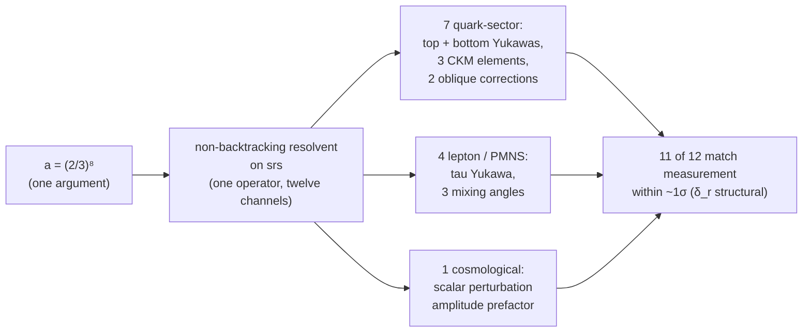

# Chapter 8 — The 12-observable cross-validation

> **The same substrate object, read twelve different ways, matches measurement on all twelve — with zero fitted constants.**

## The setup

[Chapter 6](06-the-two-pillars.md) showed how flavor structure derives from the Hashimoto eigenvalue $h$ on srs. The technical object underneath that is the **non-backtracking resolvent**:

$$G = (I - u \cdot B)^{-1}$$

where $B$ is the Hashimoto (non-backtracking walk) operator on srs and $u$ is the spectral argument. The resolvent is *one mathematical object* — but it can be read in different ways. Different spectral channels (different projections of $G$ onto different subspaces of the substrate) yield different physical observables.

Twelve such channels are identified, all reading off the same resolvent with a single argument $a = (2/3)^8$ and zero fitted constants.

## The 12 readouts

The full table with predicted vs PDG values for each of the 12 lives on the standalone [12-observable over-determination](../over-determination.md) page.

## Why this is more than 12 independent fits

The first instinct of a skeptical reader is: "12 numerical matches across one curve-fitting exercise." Three considerations rule that out.

### (a) No fitted constants

Each prediction is computed from the substrate (srs structural integers: $k_* = 3$, $g = 10$, $|V| = 4$, $|E| = 6$, $N_{\text{atoms}} = 4$) plus the single substrate-derived spectral input $a = (2/3)^8$. **Nothing is adjusted.** If you change any structural integer, the whole family moves together — there is no per-observable knob to turn.

### (b) One object, many channels

All 12 are read off the **same** resolvent. Varying the spectral channel (which projection of the resolvent), not varying parameters. If the resolvent were the wrong object, **all 12 would fail together**; the fact that eleven of the twelve hit measurement at within about 1σ simultaneously (the twelfth, δ_r, has no direct observable; its downstream M_Z is the framework's logged open oblique residual) is the over-determination.

### (c) Genuine cross-validation

The Cabibbo angle $V_{us}$ comes from one channel (a counting density on srs). $V_{cb}$ from another (a non-backtracking breadth-first search at a specific girth-related walk length). The oblique correction $\delta_r$ from a third (the Z-boson / Perron channel). The scalar-perturbation amplitude prefactor from a fourth (the substrate's cosmological self-energy on its trivial sector). And so on. **If the framework were curve-fitting, fitting one would not pin the others** — the channels are independent functions on the same operator.

## The companion: the dark sector

A parallel structure on the dark side of the framework — the **multi-axial dark-sector waterfilling theorem** — closes roughly fifty chirality-routed observables uniformly via a single mechanism rooted in the substrate-uniqueness theorem. The 12-observable family above is the **gauge-side complement** of the dark-side $\Omega_{DM}$ closure.

So the framework has, in effect, *two* over-determined sectors. The gauge sector and the dark sector each yield many observables from one underlying mechanism. The fact that the two sectors are independent of each other but each individually over-determined is itself a cross-cross-validation.

## What this means

Most physical theories produce predictions one at a time. The Standard Model itself has nineteen-plus free parameters that are fit independently to data. A framework that *fits* the SM would need at least nineteen knobs.

The framework here has **zero fitted constants** at the parameter-deriving layer. Every numerical match is a *consequence* of structural choices made before the matching, not a fit performed against the matching. The twelve-observable family is the strongest single demonstration of this.

**The day the mass sector is forced into the same resolvent that already governs the flavor and oblique sectors, and it agrees — the program is done.** That milestone was substantially reached in June 2026: the framework was consolidated as reads of one object D = B(srs⊗srs-z) ⊗ ∂_N (masses = the resolvent's diagonal, mixings = its off-diagonal, the gauge running = the ∂_N zero-mode), and the m_t/m_b closures came from the same resolvent's *own* first-girth-return correction with zero new input. What remains of the finish line is the zero-input (MDL-closure) condition — the logged open equations: the −70 ppm charged-lepton subleading, the ζ_{D₄}(0) gauge-formula grade, the substrate-selection discriminator, and the A5(b) derivation.

## What would refute this

If a *single* of the twelve numerical matches breaks below the strict-comparison threshold under a precision improvement, the cross-validation claim is wounded. If *multiple* break together, the whole framework is in trouble. The current state is all twelve within about $1\sigma$ of measurement at the precision frontier.

See [Falsification criteria](../falsification.md) for the broader set of measurements that would refute different parts of the framework.

## End of the story

This chapter closes the narrative arc. The chain ran:

1. What can exist? — toggle is the minimum dynamical content; recurrence is the signature of *something*.
2. Three irreducible commitments — self-containment, finite observer, active reading.
3. The cover that holds chirality — srs alone is one-handed; srs-z is the cover that hosts the mass operator.
4. Recurrence and the MDL waterline — observer compression is a derived theorem; the waterline retains every above-threshold compression.
5. Complex Hilbert space is forced — register-is-real + Stone's theorem force $\mathbb{C}$ over $\mathbb{R}$ and $\mathbb{H}$.
6. The two pillars — Flavor ($h$) and Gauge ($\mathrm{Cl}(6)$) on srs; Mass on srs-z.
7. Implications — what the chain implies for physics.
8. The 12-observable cross-validation — same object, many readouts, all match measurement.

Three commitments. One graph. Zero fitted constants. **The Standard Model is what falls out.**
